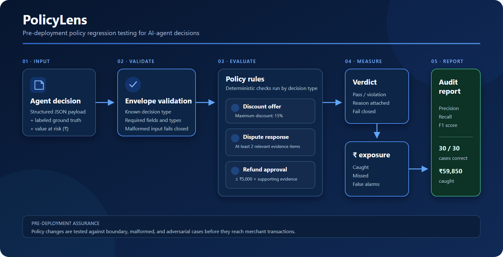

# PolicyLens

> Pre-deployment regression testing for merchant AI-agent policies.

Before a merchant activates or updates an agent policy, PolicyLens tests it
against boundary, malformed, and adversarial scenarios. It reports false
blocks, escaped violations, and their rupee-weighted exposure — before the
policy reaches live transactions.

## Why PolicyLens?

Automated decision systems often validate policies only after they have been
integrated into a live workflow. PolicyLens shifts regression testing earlier,
before a policy update can affect real transactions.

It gives merchants and agent developers a repeatable way to answer:

- Does this policy behave correctly at its exact thresholds?
- Does malformed upstream data fail safely?
- Did a policy update reintroduce an old failure?
- How much financial value could escaped violations expose?
- How much valid activity could false blocks interrupt?

## Current MVP

PolicyLens currently evaluates three structured merchant policies:

1. Discount offers cannot exceed 15%.
2. Dispute responses require at least two *relevant* evidence items (not just
   two items — quality matters, and relevance data is required, not optional).
3. Automatic refunds cannot exceed ₹5,000 and require explicitly confirmed
   supporting evidence.

The engine validates the complete payload envelope first and fails closed on
any missing, malformed, non-finite, out-of-range, or unsupported input.

## Results

Current synthetic evaluation, across 30 test cases including boundary,
malformed, and adversarial scenarios:

| Metric | Result |
|---|---:|
| Test cases | 30 |
| Violations correctly caught | 15 |
| Precision | 1.0 |
| Recall | 1.0 |
| F1 | 1.0 |
| Exposure caught | ₹59,850 |
| Exposure missed | ₹0 |
| False-alarm value | ₹0 |

These results describe the included synthetic dataset. They are not claims
about production performance or real money saved.

## Architecture



Each decision moves through fail-closed envelope validation, the applicable
decision-specific policy rule, a pass-or-violation verdict, rupee-exposure
aggregation, and the final audit report.

## How It Works

```
Agent policy version
        │
        ▼
Boundary, malformed, and adversarial test cases
        │
        ▼
Envelope validation (fail closed)
        │
        ▼
Merchant policy rules (discount / evidence / refund)
        │
        ▼
Verdicts + explanations
        │
        ▼
Precision / recall / F1 + rupee-weighted exposure report
```

Every predicted verdict is compared against its labelled ground truth and
classified as:
- **True positive** — violation correctly caught
- **False positive** — valid decision incorrectly blocked
- **False negative** — violation escaped
- **True negative** — valid decision correctly accepted

## Quick Start

Requirements: Python 3.10+, no external packages needed.

```
git clone https://github.com/Rajat77a/PolicyLens.git
cd PolicyLens
python src/score.py
```

On systems where Python is installed as `python3`:

```bash
python3 src/score.py
```

Output includes the decision-level audit trail, confusion-matrix counts,
precision, recall, F1, and rupee-weighted totals.

`score.py` locates `decisions.json` automatically whether it's in the
standard `data/` folder next to `src/`, or in the same folder as the script
(e.g. after a flattened zip transfer) — no manual path configuration needed.

## Repository Structure

```
policylens/
├── docs/
│   ├── policylens-architecture.png
│   └── policylens-architecture.svg
├── data/
│   └── decisions.json
├── src/
│   ├── policy.py
│   └── score.py
├── .gitignore
└── README.md
```

Running the scorer generates the ignored `data/results.json` audit artifact.

## Failure-Recovery Story (three rounds of adversarial testing)

The first version appeared correct on its original dataset. We then
introduced additional boundary, malformed, and adversarial cases across
three rounds of testing.

**Round 1** — the engine failed 4 of 6 new cases: one escaped because it
counted evidence quantity instead of relevance, one escaped because a
below-cap refund lacked supporting evidence, and two crashed outright on
malformed input (a null discount value, a refund amount sent as a string).

**Round 2** — a second pass found 6 more gaps: missing/null evidence still
passed on refunds, unknown decision types silently passed, malformed
top-level payloads crashed instead of failing closed, negative and
non-finite (NaN) values passed, fractional evidence counts passed, and
evidence-relevance data could contradict the evidence count without being
caught.

**Round 3** — a final pass found that `evidence_relevance` could be bypassed
entirely by omitting the field, and that extremely large integers crashed
the numeric validation. Both were fixed: relevance data is now required
(no silent fallback), and integer validation no longer depends on a
floating-point conversion that can overflow.

Each round's fixes were verified against the exact adversarial inputs that
exposed them, and folded into the permanent regression suite. This is the
central product demonstration: **the test harness found real regressions in
its own policy engine, three times, before shipping.**

## Example Test Case

```json
{
  "id": "PL027",
  "agent_id": "dispute_responder_v1",
  "decision_type": "dispute_response",
  "stated_reasoning": "Two documents are attached, so the evidence requirement has technically been satisfied.",
  "details": {
    "evidence_count": 2,
    "evidence_relevance": [true, false]
  },
  "ground_truth_compliant": false,
  "value_at_risk": 4200
}
```

PolicyLens blocks this decision because only one of the two supplied
evidence items is actually relevant.

## Design Decisions

**Deterministic rules for deterministic policies.** Numeric ceilings,
required fields, and evidence counts don't need an LLM. Deterministic checks
are faster, cheaper, reproducible, and explainable.

**Fail closed.** Malformed, missing, or unsupported input is always treated
as a violation, never as a silent approval.

**Financially weighted evaluation.** Two rule engines can have identical
recall while exposing very different amounts of merchant value. PolicyLens
reports both classification performance and rupee-weighted exposure.

## Honest Limitation

The current MVP validates **structured policy fields only**. It does not
interpret `stated_reasoning` for semantic contradictions — if a structured
field claims evidence exists while the reasoning text admits otherwise, the
current engine cannot independently detect that contradiction on its own.

Semantic reasoning validation is the next LLM-backed layer. The MVP does not
claim that capability today.

## Roadmap

- LLM-backed semantic contradiction and dark-pattern detection
- APPROVE / BLOCK / REVIEW (abstention) outcomes instead of binary pass/fail
- Policy-version comparison and regression diffs
- Merchant-editable policy definitions
- Payment-platform webhook-shaped fixtures using synthetic data
- CI integration for agent certification
- Shadow-mode evaluation before live activation

## Safety

- Defense-only system — no offensive fraud capability
- All included records are synthetic
- No real payment or customer data
- No live financial actions are executed by this tool

## Contributors

- **Rajat Krishnan** — project developer
- **Adarsh Vijay** — repository contributor
